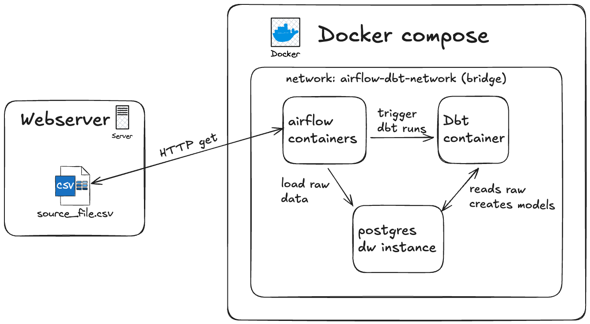
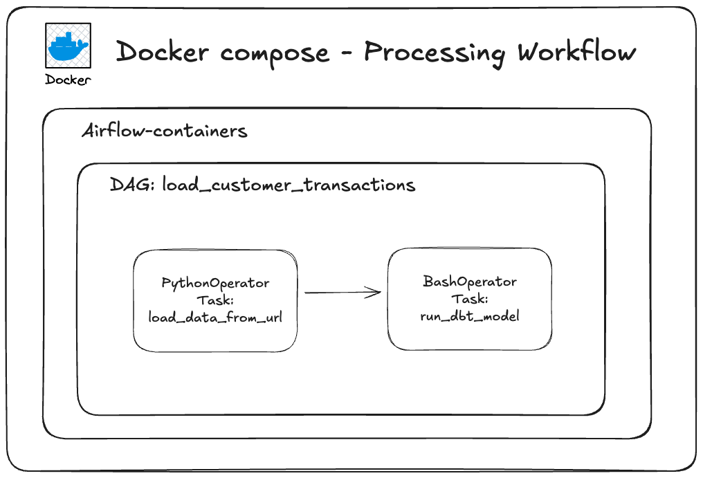
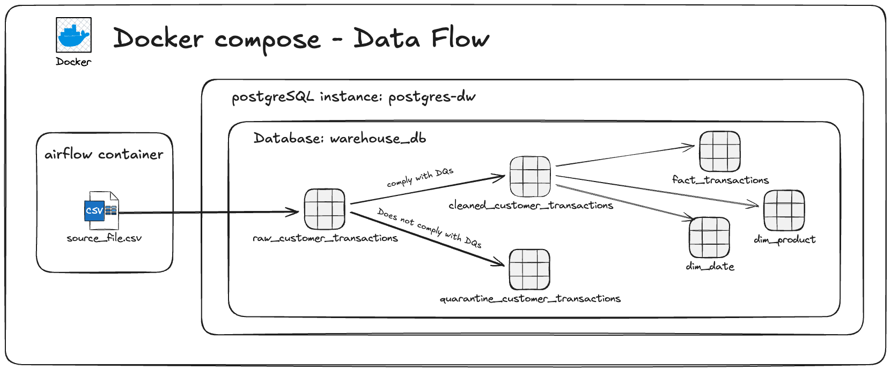

# Airflow + DBT for loading and transforming data

This project provides a complete data engineering environment through a Docker Compose configuration that integrates Apache Airflow with dbt (data build tool) for orchestrating data workflows within a PostgreSQL database. The stack enables end-to-end data pipeline development, from raw data ingestion to transformed analytical models, all containerized for easy deployment and reproducibility. By combining Airflow's workflow orchestration capabilities with dbt's transformation framework, the project demonstrates modern ELT (Extract, Load, Transform) patterns where data is first loaded into PostgreSQL and then transformed using dbt's modular SQL-based approach.

## Architecture Overview
The Docker Compose environment orchestrates an ELT pipeline using three main components connected via a bridge network (airflow-dbt-network).



### External Data Source:

A webserver hosts CSV source files externally, accessible via HTTP GET requests. This simulates a typical scenario where raw data is pulled from remote sources.

```
In a production deployment this step could replaced by a S3/blob/cloud storage 
bucket where there are the `pg_dump` of the postgres tables.
In this case authentication and a private networking channel should be incorporated 
within the solution.
```

### Core Components (Inside Docker Compose):

1.  **Airflow Containers**: All the docker containers necessary to deploy an airflow instance (webserver, worker nodes, scheduler node, postgres instance for metadata, etc). The Airflow acts as the orchestration layer, responsible for:
    - Fetching CSV files from the webserver via HTTP GET
Loading raw data directly into the PostgreSQL data warehouse (a pg_load could be used to optimize the data load in the raw layer)
    - Triggering dbt runs to update the models also within the PostgreSQL


2. **PostgreSQL DW Instance**: Serves as the centralized data warehouse where:

    - Airflow loads raw, untransformed data
dbt reads from raw tables and writes transformed models
Both source data and analytical models coexist in the same database


3. **Dbt Container**: Executes transformation logic by:
    - Connecting to PostgreSQL to read raw data
    - Running SQL-based transformations defined in dbt models
    - Creating cleaned, aggregated, or business-logic-enriched tables/views

## Processing Flow
The `load_customer_transactions` DAG implements a simple two-task ELT workflow within Airflow. The first task (`load_data_from_url`) uses a **PythonOperator** to fetch the CSV file via HTTP request from the external webserver and load it directly into the `raw_customer_transactions` table in PostgreSQL's raw zone, handling the extraction and loading phases. Once the raw data is successfully loaded, the second task (`run_dbt_model`) uses a **BashOperator** to execute dbt commands (`dbt run`) that trigger the transformation layer, which applies data quality checks, splits records into cleaned and quarantined datasets, and builds the dimensional models (fact_transactions, dim_date, dim_product) in the data warehouse.Retry



## Dataflow


**1. Ingestion (Airflow -> PostgreSQL)**
- Airflow container fetches `source_file.csv` and loads it into the `raw_customer_transactions` table in the `warehouse_db` database within the PostgreSQL instance (`postgres-dw`)

**2. Data Quality Split (dbt staging layer)**
- dbt reads from `raw_customer_transactions` and applies data quality checks
- **Compliant records**: routed to `cleaned_customer_transactions` (cleaned staging table)
- **Non-compliant records**: routed to `quarantine_customer_transactions` (error handling)

**3. Dimensional Modeling (dbt marts layer)**
- dbt transforms `cleaned_customer_transactions` into a star schema:
  - **`fact_transactions`**: Fact table with transaction information
  - **`dim_date`**: Date dimension for time-based analysis
  - **`dim_product`**: Product dimension for product attributes

## Data Quality Query
```sql
WITH exceptions_tax_field AS (
    SELECT 
        *,
        CASE 
            WHEN tax IS NULL THEN 'The tax field is NULL' 
            ELSE 'The tax field does not match numeric datatype' 
        END AS error_message
    FROM {{ source('raw_data', 'raw_customer_transactions') }}
    WHERE tax IS NULL 
        OR NOT (tax ~ '^[+-]?(\d+(\.\d*)?|\.\d+)([eE][+-]?\d+)?$')
),

exceptions_price_field AS (
    SELECT 
        *,
        CASE 
            WHEN price IS NULL THEN 'The price field is NULL' 
            ELSE 'The price field does not match numeric datatype' 
        END AS error_message
    FROM {{ source('raw_data', 'raw_customer_transactions') }}
    WHERE price IS NULL 
        OR NOT (price ~ '^[+-]?(\d+(\.\d*)?|\.\d+)([eE][+-]?\d+)?$')
),

exceptions_transaction_id_field AS (
    SELECT 
        *,
        CASE 
            WHEN transaction_id IS NULL THEN 'The transaction_id field is NULL' 
            ELSE 'The transaction_id field does not match numeric datatype' 
        END AS error_message
    FROM {{ source('raw_data', 'raw_customer_transactions') }}
    WHERE transaction_id IS NULL 
        OR NOT (transaction_id ~ '^[+-]?(\d+(\.\d*)?|\.\d+)([eE][+-]?\d+)?$')
),

exceptions_product_id_field AS (
    SELECT 
        *,
        CASE 
            WHEN product_id IS NULL THEN 'The product_id field is NULL' 
            ELSE 'The product_id field does not match numeric datatype' 
        END AS error_message
    FROM {{ source('raw_data', 'raw_customer_transactions') }}
    WHERE product_id IS NULL 
        OR NOT (product_id ~ '^[+-]?(\d+(\.\d*)?|\.\d+)([eE][+-]?\d+)?$')
),

exceptions_customer_id_field AS (
    SELECT 
        *,
        CASE 
            WHEN customer_id IS NULL THEN 'The customer_id field is NULL' 
            ELSE 'The customer_id field does not match numeric datatype' 
        END AS error_message
    FROM {{ source('raw_data', 'raw_customer_transactions') }}
    WHERE customer_id IS NULL 
        OR NOT (customer_id ~ '^[+-]?(\d+(\.\d*)?|\.\d+)([eE][+-]?\d+)?$')
),

exceptions_quantity_field AS (
    SELECT 
        *,
        CASE 
            WHEN quantity IS NULL THEN 'The quantity field is NULL' 
            ELSE 'The quantity field does not match numeric datatype' 
        END AS error_message
    FROM {{ source('raw_data', 'raw_customer_transactions') }}
    WHERE quantity IS NULL 
        OR NOT (quantity ~ '^[+-]?(\d+(\.\d*)?|\.\d+)([eE][+-]?\d+)?$')
)

SELECT * FROM exceptions_tax_field
UNION ALL 
SELECT * FROM exceptions_price_field
UNION ALL 
SELECT * FROM exceptions_customer_id_field
UNION ALL 
SELECT * FROM exceptions_product_id_field
UNION ALL 
SELECT * FROM exceptions_quantity_field
UNION ALL 
SELECT * FROM exceptions_transaction_id_field
```

**Data Quality & Quarantine Pattern:**
This pattern implements a defensive data quality layer where raw transactions are split into two paths based on business rules. 
The `cleaned_customer_transactions` model accepts only records that comply with all data quality constraints (non-null keys, valid amounts, and IDs), while non-compliant records are routed to `quarantine_customer_transactions` with timestamped rejection reasons. This quarantine approach prevents bad data from corrupting downstream dimensional models while preserving problematic records for investigation, reprocessing, or auditing purposes. The pattern ensures that only validated, business-ready data flows into the star schema (fact_transactions, dim_date, dim_product), maintaining data integrity throughout the analytical pipeline.


## Running the Project Locally
### Clone and Run Project on Mac

#### Prerequisites
```bash
# Ensure Docker Desktop is installed and running
# Download from: https://www.docker.com/products/docker-desktop
```

#### Clone Repository
```bash
# Clone the repository
git clone https://github.com/MozartNeto/airflow_plus_dbt_proj.git

# Navigate to project directory
cd airflow_plus_dbt_proj
```

#### Start Docker Compose Stack
```bash
# Build and start all services in detached mode
docker-compose up -d

# Or build with fresh images (if you need to rebuild)
docker-compose up --build -d

# Check running containers
docker-compose ps
```

### Useful Commands
```bash
# View logs for all services
docker-compose logs -f

# View logs for specific service
docker-compose logs -f airflow

# Execute commands inside airflow container
docker-compose exec airflow bash

# run dbt models
docker-compose exec dbt dbt run

# run inside DW PostgreSQL instance
psql -U admin -d warehouse_db
```
